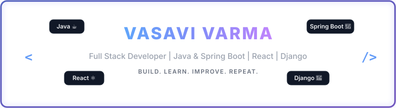

  

 

<!-- HEADER SECTION -->
<table align="center" border="0" cellpadding="0" cellspacing="0" width="100%">
  <tr>
    <!-- Avatar -->
    <td align="center" valign="middle" width="20%">
      
    </td>
    <!-- Title and Subtitle -->
    <td align="left" valign="middle" width="50%" style="padding-left: 20px;">
      Hi, I'm 
      <b>Vasavi Varma</b> 👋 
       
      Java | Spring Boot | React | Django
    </td>
    <!-- Quote Card -->
    <td align="right" valign="middle" width="30%">
      <table border="1" stroke="#374151" cellpadding="15" cellspacing="0" style="border-collapse: collapse; border-color: #374151; border-radius: 8px; background-color: #111827;">
        <tr>
          <td>
            <i>"Building secure, scalable and user-friendly applications that solve real world problems."</i>
          </td>
        </tr>
      </table>
    </td>
  </tr>
</table>

 

<!-- Quick Info Row -->

  📍 <b>India</b> &nbsp;&nbsp;•&nbsp;&nbsp; ✉️ <b>vasavi.varma@example.com</b> &nbsp;&nbsp;•&nbsp;&nbsp; 💼 <b><a href="https://www.linkedin.com/in/vasavi-varma-735473288?utm_source=share&amp;utm_campaign=share_via&amp;utm_content=profile&amp;utm_medium=android_app">LinkedIn</a></b> &nbsp;&nbsp;•&nbsp;&nbsp; 💻 <b><a href="https://github.com/pvasavi123">GitHub</a></b>

<!-- ABOUT ME SECTION -->
<h2>🚀 About Me</h2>

<table border="0" cellpadding="0" cellspacing="0" width="100%">
  <tr>
    <!-- Bio Text -->
    <td valign="top" width="60%" style="padding-right: 20px; line-height: 1.6;">
      I'm a <b>Computer Science graduate</b> and Full Stack Developer passionate about building secure, practical, and user-friendly web and mobile applications.  
      I enjoy working across the frontend, backend, databases, and APIs, and I'm continuously improving my development skills by building real-world projects.
    </td>
    <!-- Highlight Cards Grid -->
    <td valign="top" width="40%">
      <table border="1" cellpadding="10" cellspacing="0" style="border-collapse: collapse; border-color: #1f2937; width: 100%; background-color: #111827;">
        <tr>
          <td width="50%" align="center">
            🎓 <b>B.Tech CSE</b> Graduate
          </td>
          <td width="50%" align="center">
            💻 <b>2+ Years</b> Learning &amp; Building
          </td>
        </tr>
        <tr>
          <td align="center">
            🚀 <b>10+ Projects</b> Built
          </td>
          <td align="center">
            ☕ <b>Java &amp; Spring</b> Specialist
          </td>
        </tr>
      </table>
    </td>
  </tr>
</table>

<!-- TECH STACK SECTION -->
<h2>🛠️ Tech Stack</h2>

<table border="0" cellpadding="0" cellspacing="0" width="100%">
  <!-- Row 1: Languages, Frontend, Backend, Databases -->
  <tr>
    <!-- Languages -->
    <td valign="top" width="25%" style="padding-right: 10px;">
      <h4>Languages</h4>
      <table border="0" cellpadding="5" cellspacing="0">
        <tr>
          <td></td>
          <td><b>Java</b></td>
        </tr>
        <tr>
          <td></td>
          <td><b>JavaScript</b></td>
        </tr>
        <tr>
          <td></td>
          <td><b>Python</b></td>
        </tr>
      </table>
    </td>

    <!-- Frontend -->
    <td valign="top" width="25%" style="padding-right: 10px;">
      <h4>Frontend</h4>
      <table border="0" cellpadding="5" cellspacing="0">
        <tr>
          <td></td>
          <td><b>React &amp; Native</b></td>
        </tr>
        <tr>
          <td></td>
          <td><b>HTML5 / CSS3</b></td>
        </tr>
        <tr>
          <td></td>
          <td><b>Tailwind CSS</b></td>
        </tr>
      </table>
    </td>

    <!-- Backend -->
    <td valign="top" width="25%" style="padding-right: 10px;">
      <h4>Backend</h4>
      <table border="0" cellpadding="5" cellspacing="0">
        <tr>
          <td></td>
          <td><b>Spring Boot</b></td>
        </tr>
        <tr>
          <td></td>
          <td><b>Django</b></td>
        </tr>
        <tr>
          <td>⚙️</td>
          <td><b>REST APIs</b></td>
        </tr>
      </table>
    </td>

    <!-- Databases -->
    <td valign="top" width="25%">
      <h4>Databases</h4>
      <table border="0" cellpadding="5" cellspacing="0">
        <tr>
          <td></td>
          <td><b>PostgreSQL</b></td>
        </tr>
        <tr>
          <td></td>
          <td><b>MySQL</b></td>
        </tr>
      </table>
    </td>
  </tr>
</table>

 

<!-- Tools Category -->
<table border="0" cellpadding="0" cellspacing="0" width="100%">
  <tr>
    <td valign="top">
      <h4>Tools &amp; IDEs</h4>
       &nbsp;
       &nbsp;
       &nbsp;
       &nbsp;
       &nbsp;
      
    </td>
  </tr>
</table>

<!-- FEATURED PROJECTS SECTION -->
<h2>📌 Featured Projects</h2>

<table border="0" cellpadding="10" cellspacing="0" width="100%">
  <tr>
    <!-- Project 1 -->
    <td valign="top" width="50%" style="padding-right: 10px;">
      <table border="1" cellpadding="15" cellspacing="0" style="border-collapse: collapse; border-color: #1f2937; width: 100%; height: 280px; background-color: #111827;">
        <tr>
          <td valign="top">
            <h4>🏨 Hostel Management System</h4>
            A mobile application designed to simplify hostel and property management operations.  
            
              ✓ Owner and tenant workflows 
              ✓ Property &amp; room status management 
              ✓ Booking and approval request tracking 
              ✓ Notifications and tenant verification 
             
            <code>React Native</code> &nbsp; <code>Expo</code> &nbsp; <code>Django</code> &nbsp; <code>PostgreSQL</code>
          </td>
        </tr>
      </table>
    </td>

    <!-- Project 2 -->
    <td valign="top" width="50%" style="padding-left: 10px;">
      <table border="1" cellpadding="15" cellspacing="0" style="border-collapse: collapse; border-color: #1f2937; width: 100%; height: 280px; background-color: #111827;">
        <tr>
          <td valign="top">
            <h4>🛒 Retail Management System</h4>
            A web-based application for managing retail operations, inventory logs, and sync status.  
            
              ✓ Product and inventory logs management 
              ✓ Database query optimization 
              ✓ Clean Spring Boot REST API services 
              ✓ Interactive frontend layout audits 
             
            <code>React.js</code> &nbsp; <code>Spring Boot</code> &nbsp; <code>MySQL</code> &nbsp; <code>REST API</code>
          </td>
        </tr>
      </table>
    </td>
  </tr>
</table>

<!-- GITHUB STATS SECTION -->
<h2>📊 GitHub Stats &amp; Contributions</h2>

<table border="0" cellpadding="0" cellspacing="0" width="100%">
  <tr>
    <!-- Contribution Grid (Custom Blue) -->
    <td align="center" valign="middle" width="50%" style="padding-right: 10px;">
      <table border="1" cellpadding="10" cellspacing="0" style="border-collapse: collapse; border-color: #1f2937; width: 100%; background-color: #111827;">
        <tr>
          <td align="center">
            <b>Contribution Calendar</b>  
            
          </td>
        </tr>
      </table>
    </td>
    <!-- Streak stats -->
    <td align="center" valign="middle" width="50%" style="padding-left: 10px;">
      <table border="1" cellpadding="10" cellspacing="0" style="border-collapse: collapse; border-color: #1f2937; width: 100%; background-color: #111827;">
        <tr>
          <td align="center">
            <b>Activity Streak</b>  
            
          </td>
        </tr>
      </table>
    </td>
  </tr>
</table>

<!-- GOALS & CONNECT -->
<table border="0" cellpadding="0" cellspacing="0" width="100%">
  <tr>
    <!-- Current Goals -->
    <td valign="top" width="50%" style="padding-right: 20px;">
      <h3>🎯 Current Goals</h3>
      <ul>
        <li>Deepen expertise in Java &amp; Spring Boot microservices</li>
        <li>Build highly scalable and secure full-stack apps</li>
        <li>Explore AI/LLM endpoint integrations in backend code</li>
        <li>Contribute to open-source developer toolings</li>
      </ul>
    </td>
    <!-- Connect With Me -->
    <td valign="top" width="50%">
      <h3>🤝 Connect With Me</h3>
      
I'm always open to discussing technical projects, opportunities, or innovative ideas.

       
       &nbsp;&nbsp;
      
    </td>
  </tr>
</table>

  

  ⭐ Built with ❤️ by <b>pvasavi123</b>

